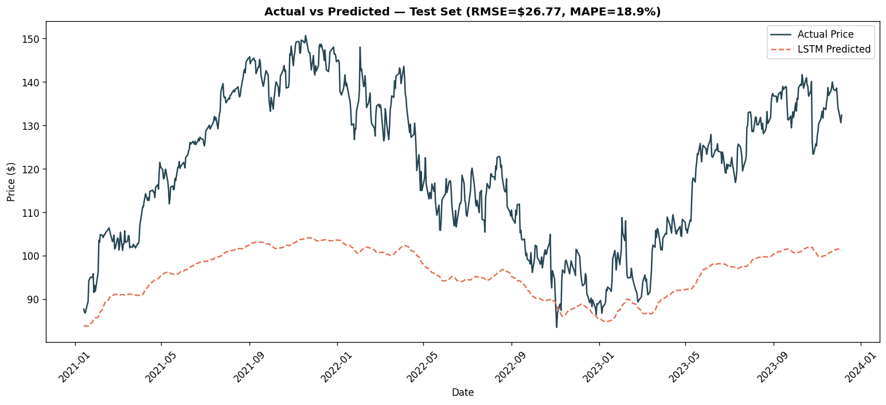
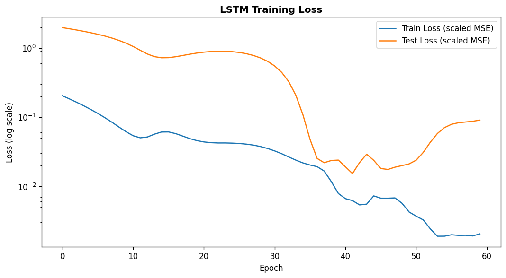

# 📈 Google Stock Price Prediction — LSTM (PyTorch)

An LSTM-based time series forecaster trained on **19 years of real Google (GOOG) stock data** (2004–2023), with proper time-series methodology: chronological splitting, no shuffling, no data leakage.

## 🎯 Highlights

- **Real dataset**: 4,858 real trading days of GOOG closing prices
- **Correct time-series practice**: train/test split is chronological (never shuffled), scaler fit only on training data
- **PyTorch LSTM** (2 layers, 64 hidden units) trained from scratch
- **Recursive multi-day forecasting** in the Streamlit app
- Honest about limitations — this is a price-only model, clearly disclaimed as educational

## 📊 Results

| Metric | Value |
|---|---|
| Test RMSE | $26.77 |
| Test MAE | $23.96 |
| Test MAPE | 18.91% |

### Actual vs Predicted (Test Set)


### Training Curves


## 🗂️ Project Structure

```
stock_project/
├── Stock_Price_LSTM.ipynb   # Full notebook
├── app.py                    # Streamlit app (recursive forecast)
├── train_lstm.py             # Training script
├── evaluate_lstm.py          # Evaluation + visualization
├── data/GOOG.csv             # Real Google stock data (2004-2023)
├── models/
│   ├── stock_lstm.pt
│   ├── scaler.pkl
│   └── config.json
├── images/
└── requirements.txt
```

## 🚀 Quick Start

```bash
pip install -r requirements.txt
streamlit run app.py
# or
jupyter notebook Stock_Price_LSTM.ipynb
```

## 🧠 Methodology

1. **Chronological split** (85/15) — train on the past, test on the future only
2. **MinMax scaling** fit only on training data (no leakage into test set)
3. **Sliding window** — 60 days of history → predict day 61
4. **Architecture** — 2-layer LSTM (64 hidden units, dropout 0.2) → Dense(1)
5. **Recursive forecasting** — each day's prediction feeds into the next day's input

## ⚠️ Disclaimer

This is an educational project demonstrating LSTM time-series methodology. Real stock prices are
driven by news, earnings, macroeconomic events, and market sentiment — none of which this
price-only model sees. **Not financial advice.**

## 🛠️ Tech Stack

`pytorch` · `pandas` · `scikit-learn` · `matplotlib` · `streamlit`

## 📈 Future Improvements

- Add volume, technical indicators (RSI, MACD) as extra input features
- Multi-variate LSTM / Transformer-based forecaster
- Prediction intervals (quantile regression) instead of point estimates
- Backtest a simple trading strategy vs buy-and-hold baseline

---
*Built as part of an advanced ML portfolio.*
